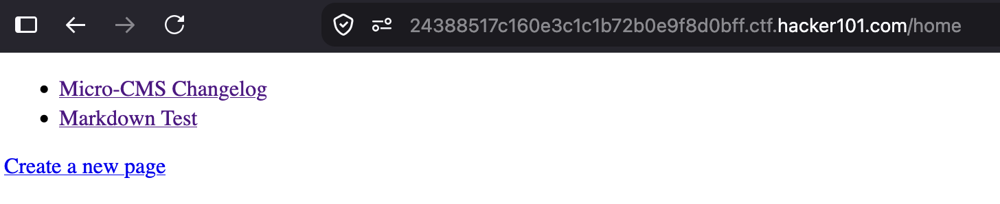
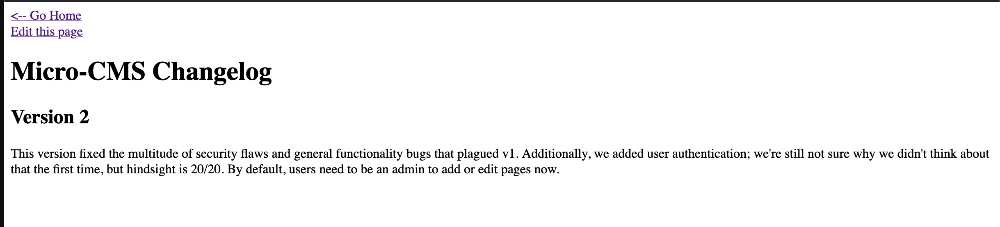
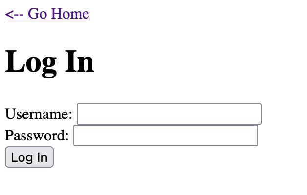
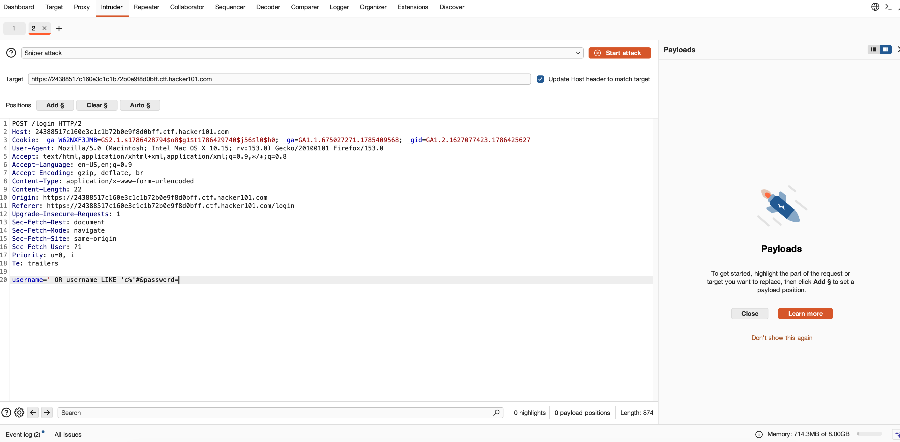

# Micro-CMS v2 — Authentication and authorization failures

## Overview

- **Platform:** Hacker101 CTF
- **Difficulty:** Level 2
- **Category:** Web security
- **Status:** Solved
- **Flags found:** 3 of 3

## Goal

Find the flags in the Micro-CMS v2 application by testing its authentication and edit workflows in the authorized Hacker101 CTF environment.

## Environment and scope

- **Target:** Hacker101 CTF Micro-CMS v2
- **Tools:** Browser, Burp Suite Repeater, and Burp Suite Intruder
- **Techniques:** SQL injection, authentication bypass, method-based authorization testing, blind SQL injection

## Finding 1 — Login bypass through SQL injection

### Observation

The changelog page exposes an **Edit this page** link. Opening it while logged out leads to a login form. Submitting a single quote (`'`) as the username, with an empty password, produced a database-style error while a double quote did not. That difference suggested that the username input was being concatenated into SQL.







### Why the bypass works

The vulnerable implementation was likely conceptually similar to:

```sql
SELECT password FROM admins
WHERE username = '<username>'
  AND password = '<password>'
```

The CTF payload supplied in the username field closes the quoted username value, appends a `UNION SELECT` result with a chosen password value, and comments out the remaining SQL. The application then treats that fabricated result as if it were a genuine account record. Supplying the same chosen value in the password field satisfies its insecure password comparison and creates an authenticated session.

### Result

After logging in, a previously unavailable **Private page** appeared from the home page and contained the first flag.

### Defensive lesson

Use parameterized queries, reject login when no genuine user record exists, and verify submitted passwords against stored Argon2id or bcrypt hashes. Never concatenate request input into a SQL statement or return database errors to the browser.

**Classification:** SQL injection / authentication bypass

## Finding 2 — POST handler bypassed edit authorization

### Observation

Requesting the protected edit route with `GET` redirected an unauthenticated browser to the login page. The same path accepted a `POST` request and returned a successful response containing the second flag.

### Test

1. Capture the request for the protected edit route in Burp Suite.
2. Send it to Repeater.
3. Change only the request method from `GET` to `POST` and resend it.
4. Compare the response: the server returned `200 OK` rather than redirecting to login.

### Why it works

HTTP method and path together select the server-side route. A likely flawed design protected only the `GET` handler that displays the edit form:

```text
GET  /page/edit/:id → authentication check → edit form or login redirect
POST /page/edit/:id → missing authentication check → process request
```

`POST` does not inherently bypass authentication. The vulnerability exists because the developer omitted the authorization middleware from the separate POST handler. In a real application, an unprotected POST edit endpoint could allow unauthenticated page modification.

### Defensive lesson

Apply shared authentication and object-level authorization checks to every route and method that reads or modifies protected data. State-changing routes also need CSRF protection, input validation, and audit logging.

**Classification:** Missing function-level authorization / method-based access-control bypass

## Finding 3 — Blind SQL injection recovered valid credentials

### Observation

The username field was already known to be injectable. The login endpoint returned measurably different responses when a true or false SQL condition was supplied, making it possible to infer information without the database directly displaying it.

### Method

The vulnerable username field was used to ask a sequence of prefix questions about the known account. The password form field remained empty. Conceptually, each request asked:

```sql
Does the account named <known username> have a password beginning with <known prefix + candidate character>?
```

`LIKE 'prefix%'` is useful here because `%` represents any remaining characters. A response-length difference served as the true/false signal.

### Burp Intruder workflow

1. Capture a login request and send it to Intruder.
2. Keep a known password prefix fixed in the injected condition.
3. Mark only the next unknown character as the single Intruder payload position.
4. Use the **Sniper** attack type and a short candidate list (letters, digits, and expected punctuation).
5. Run the requests and sort results by response length or another stable success indicator.
6. The candidate with the distinct response is the next correct character.
7. Add that character to the fixed prefix and repeat until the password is complete.
8. Log in with the recovered credentials and open the newly accessible content to capture the third flag.



### Why it works

The application accepts SQL syntax in user-controlled input. Even without a database error or displayed result, the server’s behavior leaks whether the injected condition evaluated to true. Repeating that yes/no test reveals the secret one character at a time.

### Defensive lesson

Parameterized queries prevent the submitted condition from becoming SQL syntax. Additionally, return uniform login failures, rate-limit authentication attempts, monitor anomalous requests, and use generic error handling.

**Classification:** Blind SQL injection / credential disclosure

## Key takeaways

- A quote-triggered error is evidence that input may be reaching the database as code rather than data.
- Authentication must validate a real user record, not merely trust a row-shaped query result.
- Authorization must protect every HTTP method on a sensitive route.
- Response status, redirects, body length, and body content can act as side channels in blind injection attacks.
- Parameterized queries are the primary control against all SQL-injection findings in this challenge.

## Spoiler policy

Flag values, the recovered password, and the exact live challenge hostname are intentionally omitted. This write-up documents the reasoning and defensive lessons from the authorized Hacker101 CTF only.
